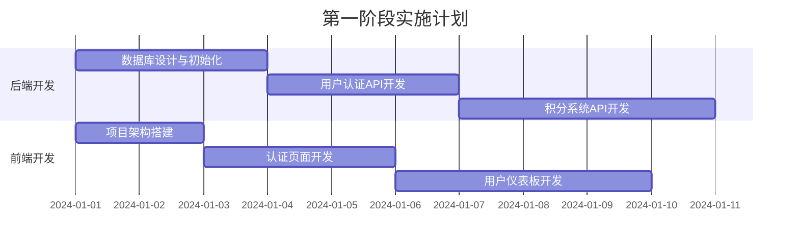
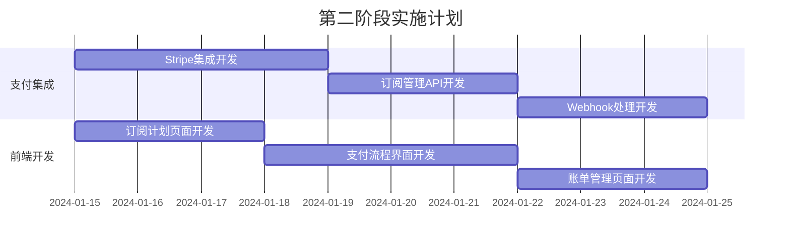
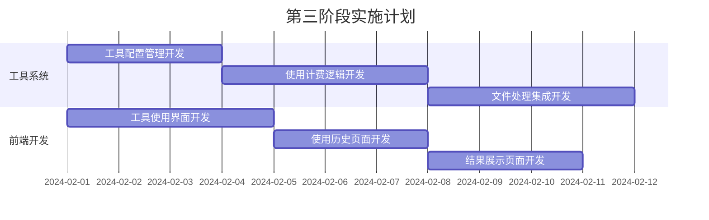
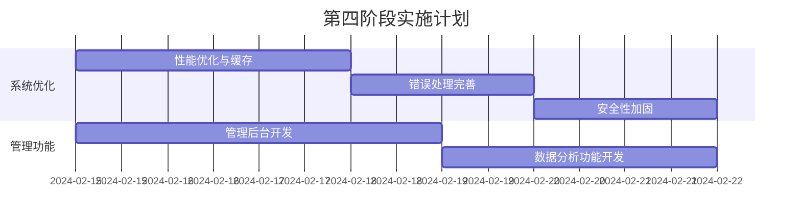

# AI工具站订阅积分系统 - 完整实施规划

## 📋 系统概览

已完成订阅积分系统的完整设计，包含以下核心模块：

### 🏗️ 系统架构
- **用户认证系统** - JWT + OAuth集成
- **积分管理系统** - 获取、消费、历史记录
- **订阅管理系统** - 多层级计划、自动计费
- **支付处理系统** - Stripe集成、Webhook处理
- **工具使用系统** - 使用计费、权限验证
- **管理后台系统** - 用户管理、数据分析

### 📊 核心功能
- ✅ 用户注册/登录（邮箱+OAuth）
- ✅ 多层级订阅计划（免费/Pro/Premium/Enterprise）
- ✅ 积分购买和自动充值
- ✅ 工具使用按积分计费
- ✅ 支付处理和账单管理
- ✅ 用户仪表板和个人中心
- ✅ 管理后台和数据分析

## 🛠️ 推荐技术栈

### 前端技术栈
```typescript
// 核心框架
- Next.js 14 (App Router)
- React 18
- TypeScript
- TailwindCSS

// 状态管理
- Zustand (轻量级状态管理)
- TanStack Query (服务端状态)

// UI组件
- Radix UI (无头组件)
- Shadcn/ui (组件库)
- Lucide Icons (图标)

// 表单处理
- React Hook Form
- Zod (数据验证)

// 支付集成
- Stripe React.js
- Stripe Elements
```

### 后端技术栈
```typescript
// 运行时和框架
- Node.js 18+
- Express.js / Fastify
- TypeScript

// 数据库
- PostgreSQL (主数据库)
- Redis (缓存和会话)
- Prisma (ORM)

// 认证和安全
- jsonwebtoken (JWT)
- bcryptjs (密码加密)
- express-rate-limit (限流)
- helmet (安全头)

// 支付和集成
- Stripe SDK
- Nodemailer (邮件)
- Bull Queue (任务队列)

// 监控和日志
- Winston (日志)
- Sentry (错误监控)
- Prometheus (指标)
```

### 基础设施
```yaml
# 部署环境
- Vercel / Netlify (前端)
- Railway / Render (后端)
- Supabase / Neon (数据库)
- Upstash Redis (缓存)

# CDN和存储
- Cloudinary (图片处理)
- AWS S3 (文件存储)
- CloudFlare (CDN)

# 监控和分析
- Vercel Analytics
- PostHog (用户分析)
- Stripe Dashboard (支付分析)
```

## 🚀 分阶段实施路线图

### 第一阶段：基础系统（2-3周）


**目标功能：**
- ✅ 用户注册/登录系统
- ✅ 基础积分管理
- ✅ 用户个人中心
- ✅ 基础工具使用流程

**关键任务：**
1. 设置数据库和基础数据模型
2. 实现JWT认证系统
3. 开发积分CRUD操作
4. 创建用户注册/登录界面
5. 构建用户仪表板

### 第二阶段：订阅支付系统（2-3周）


**目标功能：**
- ✅ 多层级订阅计划
- ✅ Stripe支付集成
- ✅ 自动订阅计费
- ✅ 积分购买功能

**关键任务：**
1. 集成Stripe支付系统
2. 实现订阅创建和管理
3. 开发Webhook事件处理
4. 创建订阅计划选择界面
5. 构建支付表单和流程

### 第三阶段：工具集成系统（2-3周）


**目标功能：**
- ✅ 工具使用权限验证
- ✅ 自动积分扣除
- ✅ 使用历史记录
- ✅ 文件处理集成

**关键任务：**
1. 实现工具使用前验证
2. 开发积分扣除逻辑
3. 集成文件处理服务
4. 创建工具使用界面
5. 构建使用历史展示

### 第四阶段：优化完善（1-2周）


**目标功能：**
- ✅ 系统性能优化
- ✅ 管理后台界面
- ✅ 数据分析和报告
- ✅ 安全性加固

## 📁 项目文件结构

```
ai-tool-template/
├── docs/                           # 设计文档
│   ├── database-schema.sql         # 数据库设计
│   ├── credits-system-logic.md     # 积分系统逻辑
│   ├── subscription-payment-system.md  # 订阅支付系统
│   ├── frontend-architecture.md    # 前端架构
│   ├── api-backend-design.md       # API后端设计
│   └── implementation-roadmap.md   # 实施路线图
│
├── src/
│   ├── components/                 # React组件
│   │   ├── auth/                  # 认证组件
│   │   ├── subscription/          # 订阅组件
│   │   ├── credits/               # 积分组件
│   │   ├── payments/              # 支付组件
│   │   ├── tools/                 # 工具组件
│   │   └── ui/                    # 基础UI组件
│   │
│   ├── app/                       # Next.js App Router
│   │   ├── auth/                  # 认证页面
│   │   ├── dashboard/             # 用户仪表板
│   │   ├── subscription/          # 订阅管理
│   │   ├── credits/               # 积分管理
│   │   ├── tools/                 # 工具页面
│   │   ├── admin/                 # 管理后台
│   │   └── api/                   # API路由
│   │
│   ├── lib/                       # 工具库
│   │   ├── auth.ts                # 认证逻辑
│   │   ├── db.ts                  # 数据库连接
│   │   ├── stripe.ts              # Stripe集成
│   │   ├── credits.ts             # 积分管理
│   │   └── utils.ts               # 通用工具
│   │
│   ├── hooks/                     # 自定义Hooks
│   │   ├── useAuth.ts             # 认证Hooks
│   │   ├── useCredits.ts          # 积分Hooks
│   │   ├── useSubscription.ts     # 订阅Hooks
│   │   └── usePayments.ts         # 支付Hooks
│   │
│   ├── stores/                    # 状态管理
│   │   ├── authStore.ts           # 认证状态
│   │   ├── creditsStore.ts        # 积分状态
│   │   └── subscriptionStore.ts   # 订阅状态
│   │
│   └── types/                     # TypeScript类型
│       ├── auth.ts                # 认证类型
│       ├── credits.ts             # 积分类型
│       ├── subscription.ts        # 订阅类型
│       └── api.ts                 # API类型
│
├── prisma/                        # 数据库配置
│   ├── schema.prisma              # Prisma模型
│   └── migrations/                # 数据库迁移
│
├── public/                        # 静态资源
└── package.json                   # 依赖配置
```

## 🔧 环境配置

### 环境变量配置
```bash
# .env.local
# 数据库
DATABASE_URL="postgresql://..."
REDIS_URL="redis://..."

# 认证
JWT_SECRET="your-jwt-secret"
JWT_REFRESH_SECRET="your-refresh-secret"
NEXTAUTH_SECRET="your-nextauth-secret"
NEXTAUTH_URL="http://localhost:3000"

# OAuth
GOOGLE_CLIENT_ID="..."
GOOGLE_CLIENT_SECRET="..."
GITHUB_CLIENT_ID="..."
GITHUB_CLIENT_SECRET="..."

# 支付
STRIPE_PUBLISHABLE_KEY="pk_test_..."
STRIPE_SECRET_KEY="sk_test_..."
STRIPE_WEBHOOK_SECRET="whsec_..."

# 邮件
EMAIL_SERVER_HOST="smtp.gmail.com"
EMAIL_SERVER_PORT=587
EMAIL_SERVER_USER="..."
EMAIL_SERVER_PASSWORD="..."
EMAIL_FROM="noreply@yourdomain.com"

# 文件存储
CLOUDINARY_CLOUD_NAME="..."
CLOUDINARY_API_KEY="..."
CLOUDINARY_API_SECRET="..."

# 监控
SENTRY_DSN="..."
POSTHOG_KEY="..."
```

## 🚀 部署配置

### Vercel部署（推荐）
```json
// vercel.json
{
  "functions": {
    "src/app/api/**/*.ts": {
      "maxDuration": 30
    }
  },
  "crons": [
    {
      "path": "/api/cron/refill-credits",
      "schedule": "0 0 1 * *"
    },
    {
      "path": "/api/cron/expire-credits",
      "schedule": "0 2 * * *"
    }
  ]
}
```

### Docker部署
```dockerfile
# Dockerfile
FROM node:18-alpine AS deps
WORKDIR /app
COPY package*.json ./
RUN npm ci --only=production

FROM node:18-alpine AS builder
WORKDIR /app
COPY . .
COPY --from=deps /app/node_modules ./node_modules
RUN npm run build

FROM node:18-alpine AS runner
WORKDIR /app
ENV NODE_ENV production
COPY --from=builder /app/public ./public
COPY --from=builder /app/.next/standalone ./
COPY --from=builder /app/.next/static ./.next/static
EXPOSE 3000
CMD ["node", "server.js"]
```

## 📊 监控和分析

### 关键指标监控
```typescript
// 业务指标
const keyMetrics = {
  // 用户指标
  userRegistrations: "每日新用户注册数",
  userRetention: "用户留存率",
  userChurn: "用户流失率",
  
  // 收入指标
  monthlyRecurringRevenue: "月度经常性收入(MRR)",
  averageRevenuePerUser: "平均每用户收入(ARPU)",
  lifetimeValue: "客户生命周期价值(LTV)",
  
  // 产品指标
  toolUsageRate: "工具使用率",
  creditsConsumption: "积分消费情况",
  subscriptionConversion: "订阅转化率",
  
  // 技术指标
  apiResponseTime: "API响应时间",
  errorRate: "错误率",
  uptime: "系统可用性"
};
```

### 分析工具集成
```typescript
// analytics/tracking.ts
export const analytics = {
  // 用户行为追踪
  trackUserAction: (action: string, properties?: object) => {
    if (typeof window !== 'undefined') {
      // PostHog事件追踪
      posthog.capture(action, properties);
      
      // Google Analytics事件
      gtag('event', action, properties);
    }
  },
  
  // 支付事件追踪
  trackPayment: (amount: number, currency: string, type: 'subscription' | 'credits') => {
    analytics.trackUserAction('payment_completed', {
      amount,
      currency,
      type,
      timestamp: Date.now()
    });
  },
  
  // 工具使用追踪
  trackToolUsage: (toolName: string, creditsUsed: number) => {
    analytics.trackUserAction('tool_used', {
      tool: toolName,
      credits: creditsUsed,
      timestamp: Date.now()
    });
  }
};
```

## ⚡ 性能优化建议

### 前端优化
- **代码分割**: 按路由和功能模块分割代码
- **图片优化**: 使用Next.js Image组件和Cloudinary
- **缓存策略**: 实现适当的缓存策略
- **SEO优化**: 服务端渲染和元数据管理

### 后端优化
- **数据库优化**: 添加适当索引，优化查询
- **缓存层**: Redis缓存热点数据
- **API限流**: 防止滥用和过载
- **异步处理**: 耗时操作使用队列异步处理

### 扩展性考虑
- **微服务架构**: 按业务模块拆分服务
- **负载均衡**: 多实例部署和负载分发
- **数据库分片**: 大数据量时考虑分库分表
- **CDN加速**: 静态资源全球分发

## 🔒 安全最佳实践

### 数据安全
- **密码加密**: bcrypt强加密存储
- **敏感数据**: 支付信息不落地存储
- **数据备份**: 定期自动备份
- **访问控制**: 最小权限原则

### API安全
- **HTTPS**: 全站HTTPS加密
- **CORS配置**: 限制跨域访问
- **限流保护**: 防止API滥用
- **输入验证**: 严格的数据验证

### 合规要求
- **GDPR**: 欧盟数据保护法规
- **PCI DSS**: 支付卡行业安全标准
- **隐私政策**: 明确的隐私条款
- **数据删除**: 用户数据删除权利

---

## 🎯 总结

这个完整的订阅积分系统设计包含了从数据库到前端的全栈解决方案。通过分阶段实施，可以逐步构建一个功能完善、安全可靠的商业化AI工具平台。

**核心价值：**
- 📈 **可持续商业模式** - 订阅+积分双重收入来源
- 🎯 **精细化用户管理** - 多层级权限和功能控制
- 💰 **灵活的定价策略** - 满足不同用户群体需求
- 🔒 **企业级安全标准** - 完善的安全和合规措施
- 📊 **数据驱动决策** - 全面的分析和监控体系

按照这个设计方案实施，将为您的AI工具站打造一个专业、可扩展的商业化平台。